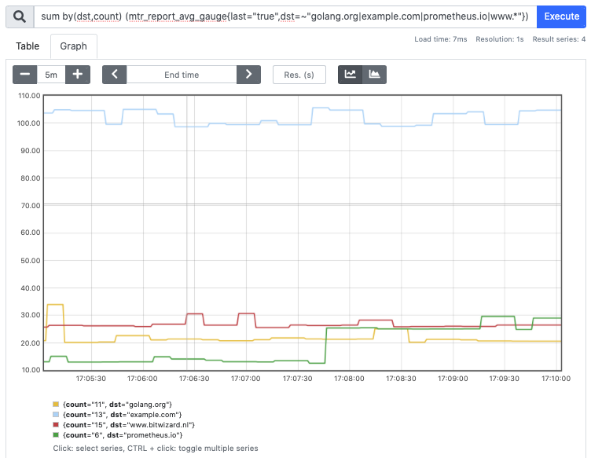
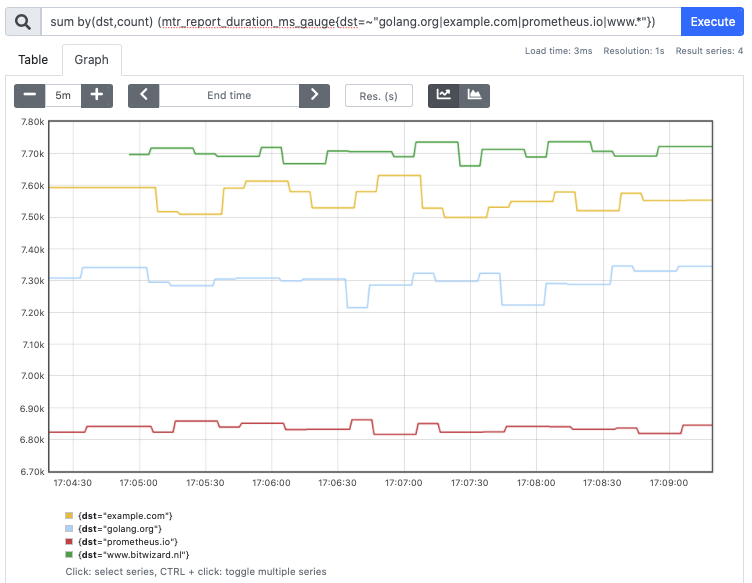

# mtr-exporter

[](https://goreportcard.com/report/github.com/mgumz/mtr-exporter)

**mtr-exporter** periodically executes [mtr] to a given host and provides the
measured results as [prometheus] metrics.

Usually, [mtr] is producing the following output:

     HOST: src.example.com       Loss%   Snt   Last   Avg  Best  Wrst StDev
     1.|-- 127.0.0.1             0.0%     2    0.6   0.6   0.6   0.7   0.1
     2.|-- 127.0.0.2             0.0%     2    6.1  10.2   6.1  14.3   5.8
     3.|-- 127.0.0.3             0.0%     2   13.0  12.3  11.6  13.0   1.0
     4.|-- 127.0.0.4             0.0%     2    7.0   9.1   7.0  11.1   2.9
     5.|-- 127.0.0.5             0.0%     2   12.5  16.5  12.5  20.6   5.7
     6.|-- 127.0.0.6             0.0%     2   19.1  18.5  17.9  19.1   0.9
     7.|-- 127.0.0.7             0.0%     2   18.3  18.2  18.0  18.3   0.2
     8.|-- 127.0.0.8             0.0%     2   89.9  61.6  33.3  89.9  40.0
     9.|-- 127.0.0.9             0.0%     2   18.5  18.3  18.1  18.5   0.2
    10.|-- 127.0.0.10            0.0%     2   20.4  19.8  19.2  20.4   0.8

`mtr-exporter` exposes the measured values like this:

    # mtr run: 2020-03-08T16:37:05.000377Z
    # cmdline: /usr/local/sbin/mtr -j -c 2 -n example.com
    mtr_runs_total{bitpattern="0x00",dst="example.com",psize="64",src="src,example.com",tests="2",tos="0"} 13 1583685425000
    mtr_report_duration_seconds{bitpattern="0x00",dst="example.com",psize="64",src="src.example.com",tests="2",tos="0x0"} 7.179 1583685425000
    mtr_report_count_hubs{bitpattern="0x00",dst="example.com",psize="64",src="src.example.com",tests="2",tos="0x0"} 10 1583685425000
    mtr_report_loss{bitpattern="0x00",hop="first",count="1",dst="example.com",host="127.0.0.1",psize="64",src="src.example.com",tests="2",tos="0x0"} 0.000000 1583685425000
    mtr_report_snt{bitpattern="0x00",hop="first",count="1",dst="example.com",host="127.0.0.1",psize="64",src="src.example.com",tests="2",tos="0x0"} 2 1583685425000
    mtr_report_last{bitpattern="0x00",hop="first",count="1",dst="example.com",host="127.0.0.1",psize="64",src="src.example.com",tests="2",tos="0x0"} 0.380000 1583685425000
    mtr_report_avg{bitpattern="0x00",hop="first",count="1",dst="example.com",host="127.0.0.1",psize="64",src="src.example.com",tests="2",tos="0x0"} 0.480000 1583685425000
    mtr_report_best{bitpattern="0x00",hop="first",count="1",dst="example.com",host="127.0.0.1",psize="64",src="src.example.com",tests="2",tos="0x0"} 0.380000 1583685425000
    mtr_report_wrst{bitpattern="0x00",hop="first",count="1",dst="example.com",host="127.0.0.1",psize="64",src="src.example.com",tests="2",tos="0x0"} 0.570000 1583685425000
    mtr_report_stdev{bitpattern="0x00",hop="first",count="1",dst="example.com",host="127.0.0.1",psize="64",src="src.example.com",tests="2",tos="0x0"} 0.130000 1583685425000

Each hop gets a label `"hop"="first"`, `"hop"="last"`, `"hop"="first_last"` or
`"hop"="intermediate"`, depending where on the path to the destination the hop
is.

Legacy: the last hop in the list of tested hosts contains the label `"last"="true"`.
Use `hop=~".*last"` in your Prometheus queries to achieve the same.

When [prometheus] scrapes the data, you can visualise the observed values:





## Usage

    $> mtr-exporter [FLAGS] -- [MTR-FLAGS]

    FLAGS:
    -bind       <bind-address>
                bind address (default ":8080")
    -flag.deprecatedMetrics
                render deprecated metrics (default: false)
                helps with transition time until deprecated metrics are gone
    -h
                show help
    -jobs       <path-to-jobsfile>
                file describing multiple mtr-jobs. syntax is given below.
    -label      <job-label>
                use <job-label> in prometheus-metrics (default: "mtr-exporter-cli")
    -mtr        <path-to-binary>
                path to mtr binary (default: "mtr")
    -schedule   <schedule>
                schedule at which often mtr is launched (default: "@every 60s")
                examples:
                   @every <dur>  - example "@every 60s"
                   @hourly       - run once per hour
                   10 * * * *    - execute 10 minutes after the full hour
                see https://en.wikipedia.org/wiki/Cron
    -tslogs
                use timestamps in logs
    -watch-jobs <schedule>
                periodically watch the file defined via -jobs (default: "")
                if it has changed stop previously running mtr-jobs and apply
                all jobs defined in -jobs.
    -version
                show version
    MTR-FLAGS:
            see "man mtr" for valid flags to mtr.

Since [mtr] itself supports the environment variable `MTR_OPTIONS`, you can
also use it to specify common options for all the launched [mtr] instances

At `/metrics` the measured values of the last run are exposed.

### Examples

    $> mtr-exporter -- example.com
    # probe every minute "example.com"

    $> mtr-exporter -- -n example.com
    # probe every minute "example.com", do not resolve DNS

    $> mtr-exporter -schedule "@every 30s" -- -G 1 -m 3 -I ven3 -n example.com
    # probe every 30s "example.com", wait 1s for response, try a max of 3 hops,
    # use interface "ven3", do not resolve DNS.

### Jobs-File Syntax

    # comment lines start with '#' are ignored
    # empty lines are ignored as well
    label -- <schedule> -- mtr-flags

`<schedule>` - a schedule expression which follows one of

* `* * * * *` - a cron expression, see https://en.wikipedia.org/wiki/Cron
* `@hourly` | `@daily` etc - see https://pkg.go.dev/github.com/robfig/cron/v3#hdr-Predefined_schedules
* `@every <duration>` - execute [mtr] in an interval

* `@every <duration> unless finished`

Example:

    quad9       -- @every 120s -- -I ven1 -n 9.9.9.9
    example.com -- @every 45s  -- -I ven2 -n example.com


## Requirements

Runtime:

* mtr-0.89 and newer (added --json support)

Build:

* golang-1.21 and newer

## Building

    $> git clone https://github.com/mgumz/mtr-exporter
    $> cd mtr-exporter
    $> make

One-off building and "installation":

    $> go install github.com/mgumz/mtr-exporter/cmd/mtr-exporter@latest

## OCI Images

OCI images for `linux/amd64` platform are available for recent releases under
https://github.com/mgumz/mtr-exporter/pkgs/container/mtr-exporter

Make sure to preserve the ENTRY command to benefit from the default
[krallin/tini](s://github.com/krallin/tini) zombie. In kubernetes, this
translates into omitting the `command` and only specifying `args` for passing
mtr-exporter
```yaml
      containers:
        - name: mtr-prometheus-collector
          image: ghcr.io/mgumz/mtr-exporter:0.4.0

          # Note: We need to override the container entry point which is an
          # array ENTRYPOINT ["/sbin/tini", "--", "/usr/bin/mtr-exporter"]
          # Only the fist element end up in the container `command`, and the two
          # others end up in the default `args` value
          # See sources at https://github.com/mgumz/mtr-exporter/blob/fd2834d5269afebfc0cd2c269a8bb26d8d816a0c/Containerfile#L29C1-L29C57
          command:
            # use tini to automatically reap zombie mtr and mtr-packet
            # processes. See
            # https://github.com/mgumz/mtr-exporter/issues/24#issuecomment-2581077241
            - "/sbin/tini"
            - "--"
            - "/usr/bin/mtr-exporter"
            # default schedule is every 60 seconds
            - "-schedule"
            - "@every 5m"
            - "--"
            - "example.com"
```


## License

see LICENSE file

## Author(s)

* Mathias Gumz <mg@2hoch5.com>

[mtr]: https://www.bitwizard.nl/mtr/index.html
[prometheus]: https://prometheus.io
